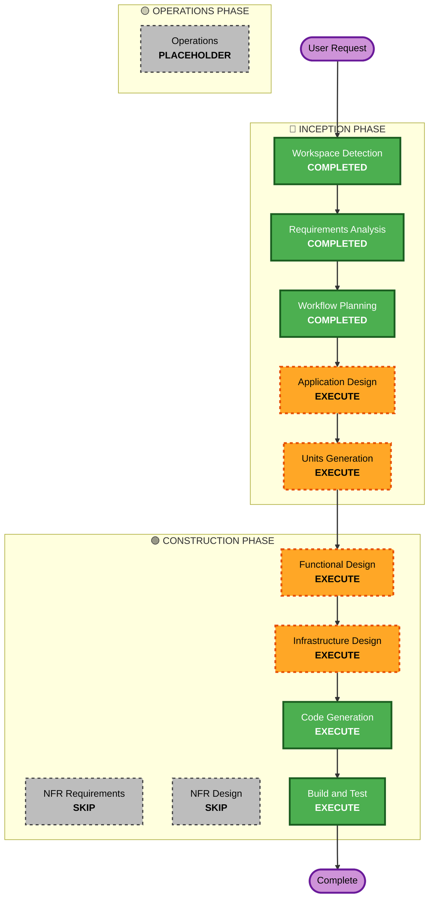

# Execution Plan

## Detailed Analysis Summary

### Change Impact Assessment
- **User-facing changes**: Yes - 고객용 주문 UI + 관리자 대시보드
- **Structural changes**: Yes - 새 프로젝트 (React + Spring Boot + PostgreSQL)
- **Data model changes**: Yes - 매장, 테이블, 메뉴, 주문 스키마 설계 필요
- **API changes**: Yes - REST API 전체 설계 필요
- **NFR impact**: Yes - SSE 실시간 통신, JWT 인증

### Risk Assessment
- **Risk Level**: Medium
- **Rollback Complexity**: Easy (Greenfield - 새 프로젝트)
- **Testing Complexity**: Moderate (Frontend + Backend + SSE 통합)

## Workflow Visualization



### Text Alternative
```
Phase 1: INCEPTION
  - Workspace Detection (COMPLETED)
  - Requirements Analysis (COMPLETED)
  - User Stories (SKIP)
  - Workflow Planning (COMPLETED)
  - Application Design (EXECUTE)
  - Units Generation (EXECUTE)

Phase 2: CONSTRUCTION
  - Functional Design (EXECUTE)
  - NFR Requirements (SKIP)
  - NFR Design (SKIP)
  - Infrastructure Design (EXECUTE)
  - Code Generation (EXECUTE)
  - Build and Test (EXECUTE)

Phase 3: OPERATIONS
  - Operations (PLACEHOLDER)
```

## Phases to Execute

### 🔵 INCEPTION PHASE
- [x] Workspace Detection (COMPLETED)
- [x] Reverse Engineering (SKIPPED - Greenfield)
- [x] Requirements Analysis (COMPLETED)
- [x] User Stories (SKIPPED - MVP 단순 프로젝트, Seed data 기반)
- [x] Workflow Planning (COMPLETED)
- [ ] Application Design - EXECUTE
  - **Rationale**: 새 프로젝트로 컴포넌트 구조, API 설계, 데이터 모델 정의 필요
- [ ] Units Generation - EXECUTE
  - **Rationale**: Frontend/Backend/Infrastructure 등 다중 unit 분해 필요

### 🟢 CONSTRUCTION PHASE
- [ ] Functional Design - EXECUTE
  - **Rationale**: 주문 프로세스, 세션 관리, SSE 등 비즈니스 로직 상세 설계 필요
- [ ] NFR Requirements - SKIP
  - **Rationale**: MVP 단계에서 보안 완화, 소규모 테이블, 성능 요구사항 최소화
- [ ] NFR Design - SKIP
  - **Rationale**: NFR Requirements 스킵에 따라 자동 스킵
- [ ] Infrastructure Design - EXECUTE
  - **Rationale**: Docker Compose 구성 + Rancher 배포 설계 필요
- [ ] Code Generation - EXECUTE (ALWAYS)
  - **Rationale**: 실제 코드 구현
- [ ] Build and Test - EXECUTE (ALWAYS)
  - **Rationale**: 빌드 및 테스트 검증

### 🟡 OPERATIONS PHASE
- [ ] Operations - PLACEHOLDER

## Estimated Timeline
- **Total Stages to Execute**: 6개 (Application Design → Units Generation → Functional Design → Infrastructure Design → Code Generation → Build and Test)
- **Total Stages to Skip**: 4개 (Reverse Engineering, User Stories, NFR Requirements, NFR Design)

## Success Criteria
- **Primary Goal**: 테이블오더 MVP 완성 - 고객 주문 + 관리자 모니터링
- **Key Deliverables**:
  - React 고객용 주문 UI
  - React 관리자 대시보드
  - Spring Boot REST API + SSE
  - PostgreSQL 데이터 스키마
  - Docker Compose 로컬 실행 환경
  - Rancher 배포 설정 (선택)
- **Quality Gates**:
  - 로컬 Docker Compose 실행 성공
  - 주문 생성 → SSE 실시간 알림 동작 확인
